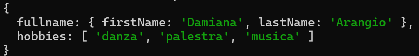

  

<h1 align="center">CommonJS Modules</h1>

Esempio di utilizzo dei moduli **CommonJS** in ambiente Node.js, con esportazione e importazione di funzioni tra file separati.

---

## Obiettivo

- Comprendere il funzionamento dei moduli CommonJS
- Esportare e importare funzioni tra file JavaScript
- Strutturare il codice in modo modulare

---

## Struttura del progetto

### 1. `names.js`
- Definizione di una funzione che accetta `firstName` e `lastName`
- La funzione restituisce un oggetto con le proprietà:
  - `firstName`
  - `lastName`
- Esportazione della funzione tramite CommonJS

---

### 2. `hobbies.js`
- Definizione di una funzione che accetta tre hobby
- La funzione restituisce un array di stringhe
- Esportazione della funzione tramite CommonJS

---

### 3. `people.js`
- Importazione delle funzioni da `names.js` e `hobbies.js`
- Definizione di una funzione senza parametri
- Creazione e restituzione di un oggetto contenente:
  - `fullName`
  - `hobbies`
- Composizione dei dati utilizzando le funzioni importate

---

## Output terminale

  

---

## Tecnologie utilizzate

- Node.js
- JavaScript (CommonJS)
